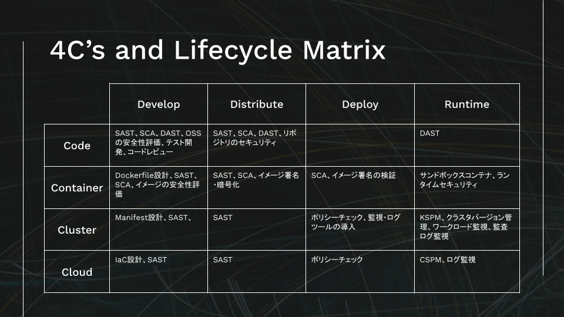

# Kubernetes 環境のセキュリティ対策

- [Kubernetes 環境のセキュリティ対策](#kubernetes-環境のセキュリティ対策)
- [基本的なセキュリティの観点](#基本的なセキュリティの観点)
  - [セキュリティの原則](#セキュリティの原則)
    - [多層防御](#多層防御)
    - [最小権限](#最小権限)
    - [職務分掌](#職務分掌)
  - [セキュリティ対策の分類](#セキュリティ対策の分類)
    - [侵入防止策](#侵入防止策)
    - [検知策](#検知策)
    - [侵入後対策](#侵入後対策)
  - [ルールベース vs リスクベース](#ルールベース-vs-リスクベース)
    - [ルールベースのセキュリティ対策](#ルールベースのセキュリティ対策)
    - [リスクベースのセキュリティ対策](#リスクベースのセキュリティ対策)
  - [セキュリティ対策の費用対効果](#セキュリティ対策の費用対効果)
- [クラウドネイティブセキュリティ](#クラウドネイティブセキュリティ)
  - [4Cモデルによる分類](#4cモデルによる分類)
  - [開発ライフサイクルにおけるセキュリティ分類](#開発ライフサイクルにおけるセキュリティ分類)
  - [4Cモデルと開発ライフサイクル](#4cモデルと開発ライフサイクル)
- [セキュリティベストプラクティス](#セキュリティベストプラクティス)
  - [コンテナのセキュリティベストプラクティス](#コンテナのセキュリティベストプラクティス)
    - [seccomp/AppArmor の有効化](#seccompapparmor-の有効化)
    - [特権コンテナの禁止](#特権コンテナの禁止)
    - [distroless イメージの利用](#distroless-イメージの利用)
    - [Checkpoint によるコンテナ保全](#checkpoint-によるコンテナ保全)
  - [Kubernetes のセキュリティベストプラクティス](#kubernetes-のセキュリティベストプラクティス)
    - [クラスタコンポーネントのセキュリティ](#クラスタコンポーネントのセキュリティ)
    - [Security Context の適用](#security-context-の適用)
    - [Secret 管理](#secret-管理)
    - [RBAC による権限管理](#rbac-による権限管理)
    - [Pod Security Admission による Pod へのポリシー強制](#pod-security-admission-による-pod-へのポリシー強制)
    - [ネットワークポリシーによる Pod 間の通信制限](#ネットワークポリシーによる-pod-間の通信制限)
    - [監視ログの利用](#監視ログの利用)
- [セキュリティツールの活用](#セキュリティツールの活用)
  - [Trivy](#trivy)
  - [Tetragon](#tetragon)
  - [OPA (Open Policy Agent) Gatekeeper](#opa-open-policy-agent-gatekeeper)
  - [Kubeclarity](#kubeclarity)
  - [External Secrets](#external-secrets)
  - [cosign](#cosign)
  - [その他のツール](#その他のツール)
- [まとめ](#まとめ)

# 基本的なセキュリティの観点

## セキュリティの原則

### 多層防御

多層防御（Defense in Depth）は、複数レイヤーのセキュリティ対策を組み合わせることで、システム全体のセキュリティを包括的に高めるアプローチです。
クラウドネイティブ環境では、従来のアプリ・インフラレイヤーに加えて、コンテナ・クラスタレイヤーのセキュリティ対策を実施する必要があります。

### 最小権限

最小権限（Least Privilege）は、認証・認可を管理する上で不可欠の原則です。
クラウドネイティブ環境における最小権限の原則は、アカウント管理に限らず、コードレベルからクラウドインフラに至るまですべてのレイヤーで適用することを求められます。

### 職務分掌

職務分掌（Separation of Duties）は、担当者の持つ役割と権限、責任範囲を明確にすることを指します。
DevOpsのような境界が曖昧な環境では、開発者と運用者が担うセキュリティ対策の責任範囲について、あらかじめ定義しておくことは特に重要です。

## セキュリティ対策の分類

### 侵入防止策

システムへの不正アクセスを未然に防ぐ、または追加の侵入を阻止することを目的とします。
侵入を阻止することで攻撃コストを引き上げ、攻撃に諦めさせる効果があります。

### 検知策

システム内での不正な活動や侵入後の動きを検知し、適切な対応策へとつなげます。早期に発見することでデータの改ざんや破壊などのシステムへの影響を最小限に抑えます。

### 侵入後対策

システムに侵入された際の影響範囲を限定したり、攻撃コストを引き上げたりすることを目的とします。影響範囲や被害状況の調査、攻撃者の排除、そしてシステムの復旧などを実施します。

## ルールベース vs リスクベース

### ルールベースのセキュリティ対策

あらかじめ実現すべきセキュリティレベルを定義し、必要な対策をシステムに一律に適用します。

ルールベースアプローチには、明確なセキュリティ基準が確立される、全従業員・全システムへの展開が容易、リスク評価を待たずに実装できるなどのメリットがあります。
一方で、全ルールを適用するコストが高い、ルールが陳腐化しやすい、特定のシステムに固有のリスクに対応しづらいなどのデメリットがあります。

### リスクベースのセキュリティ対策

システムを取り巻くリスクを評価し、システムの状況や求められるセキュリティ水準を踏まえて、リスクの最小化に取り組みます。

リスクベースアプローチは、組織やシステム固有のリスクに対応しやすく、本当に必要なセキュリティ対策に注力できます。
一方で、リスク評価にはセキュリティの専門性や自組織・システムへの深い理解が必要であり、成熟度の高い組織でなければ有効活用は難しいでしょう。

## セキュリティ対策の費用対効果

セキュリティ対策の導入検討をする際は、対策導入による「効果 - 費用」を最大化することを考えます。

費用としてはサービス利用料や人件費などの導入運用費の他、対策導入に伴う生産性（競争力）の低下も考慮します。効果としては対策導入によるリスク減少、セキュリティ品質向上に伴う競争力向上、運用効率化による生産性（競争力）向上などが評価項目となります。

# クラウドネイティブセキュリティ

クラウドネイティブ環境のセキュリティには多層防御のアプローチが必要です。ここでは、クラウドネイティブ環境の主要なセキュリティモデルと、その中で Kubernetes がどのような位置にいるのかをご説明します。

## 4Cモデルによる分類

https://kubernetes.io/ja/docs/concepts/security/overview/

※ 英語版のページがいつの間にか消えていました...

Kubernetesのセキュリティは4つの層から成り立っています。この4Cモデルは、クラウド（Cloud）、クラスタ（Cluster）、コンテナ（Container）、コード（Code）の頭文字を取ったものです。

- **クラウド（Cloud）**
  - クラウドインフラストラクチャ自体のセキュリティが基盤となります。クラウドプロバイダのセキュリティ機能を最大限に活用し、IAM（Identity and Access Management）やネットワークセキュリティを強化することが重要です。

- **クラスタ（Cluster）**
  - Kubernetesクラスタ自体のセキュリティを確保します。クラスタの設定やノード間の通信を保護するための対策を講じます。
  - 例: APIサーバーの認証と認可、ネットワークポリシー、etcdの暗号化。

- **コンテナ（Container）**
  - コンテナのセキュリティを強化します。安全なコンテナイメージの使用や、ランタイムのセキュリティ対策が含まれます。
  - 例: 署名されたイメージの使用、脆弱性スキャン、実行時のセキュリティ制御。

- **コード（Code）**
  - アプリケーションコード自体のセキュリティを確保します。セキュアなコーディングプラクティスや、コードレビュー、静的解析ツールの活用が含まれます。

## 開発ライフサイクルにおけるセキュリティ分類

https://github.com/cncf/tag-security/blob/main/security-whitepaper/v2/cloud-native-security-whitepaper-ja.md#%E3%82%AF%E3%83%A9%E3%82%A6%E3%83%89%E3%83%8D%E3%82%A4%E3%83%86%E3%82%A3%E3%83%96%E3%83%AC%E3%82%A4%E3%83%A4%E3%83%BC

ソフトウェア開発ライフサイクル（SDLC）におけるセキュリティは、ライフサイクルの各フェーズで考慮するべきです。以下の分類に基づいて、クラウドネイティブ環境におけるセキュリティ対策を実施する必要があります。

- **開発 (Develop) フェーズ**
  - アプリケーションコードやIaCなどを成果物として生成します。アプリケーションへの攻撃リスクを早期に減らすため、最初のフェーズでセキュリティチェックやテストを実施します。

- **配布 (Distribute) フェーズ**
  - コンテナイメージやVMイメージなどの成果物を構築する際に、イメージのスキャンや完全性の検証など、セキュリティに特化したステップを組み込みこみます。

- **デプロイ (Deploy) フェーズ**
  - ランタイム環境にデプロイされるアプリケーションが、組織全体のセキュリティおよびコンプライアンスポリシーに適合し、準拠していることを確認するための一連のチェックを組み込みます。

- **実行 (Runtime) フェーズ**
  - コンピュート、アクセス、ストレージの3つの領域から構成され、各領域においてアプリケーションの実行環境のセキュリティ対策を講じます。

## 4Cモデルと開発ライフサイクル

4Cモデルと開発ライフサイクルは、分類方法が異なるだけで実施すべきセキュリティ対策は共通しています。

2つの観点を統合し、そこにセキュリティ対策を当てはめると下図のようになります。

参照元: https://speakerdeck.com/kyohmizu/unlocking-cloud-native-security?slide=23

# セキュリティベストプラクティス

Kubernetes 環境のセキュリティには取り組むべきさまざまな観点がありますが、まずはベストプラクティスへの準拠を目指すことを推奨します。

本講義ではベストプラクティスの一部しか取り上げることはできませんが、現実のシステムにおいてはすべての項目を検討し、環境に適した対策を優先順位をつけて導入していくことになります。

## コンテナのセキュリティベストプラクティス

- **参考リンク**
  - https://docs.docker.com/build/building/best-practices/
  - https://cheatsheetseries.owasp.org/cheatsheets/Docker_Security_Cheat_Sheet.html
  - https://container-security.dev/

### seccomp/AppArmor の有効化

seccomp (Secure Computing Mode) と AppArmor は Linux カーネルのセキュリティ機能で、コンテナの動作を制限することで攻撃リスクを軽減します。seccomp は特定のシステムコールを制限し、不要なカーネル機能へのアクセスを防ぎます。AppArmor はファイルアクセスやプロセス間通信などを制御し、より詳細なセキュリティポリシーを設定できます。

### 特権コンテナの禁止

特権 (privileged) コンテナはホストのリソースに広範なアクセス権を持ちます。可能な限り使用を避け、必要な場合は最小限の権限で実行します。

### distroless イメージの利用

distroless イメージは最小限のファイルのみを含む軽量なコンテナイメージです。これをベースイメージとして利用することで、攻撃対象を最小限に抑えることができます。

Chainguard 社が提供する [Chainguard Images](https://www.chainguard.dev/chainguard-images) には、多くの OSS の distroless イメージが格納されています。

### Checkpoint によるコンテナ保全

https://kubernetes.io/blog/2023/03/10/forensic-container-analysis/

Checkpoint はコンテナの現在の状態をスナップショットとして保存し、後から再開したり、他の環境で再利用したりすることができる仕組みです。これは Linux の [CRIU](https://criu.org/) という機能を利用しています。セキュリティの観点では、コンテナが侵害された場合にその時点の状態を保存し、後のフォレンジック分析に役立てることができます。

Checkpoint は現状の一般的な Kubernetes 環境で利用することはできません。containerd では [v2.0 で導入予定](https://github.com/containerd/containerd/pull/6965)のため、実際に利用できるのはまだ先になると思います。またスナップショットはコンテナホスト（＝ノード）に保存されるので、ホストからスナップショットを取り出す方法についても課題があります。

## Kubernetes のセキュリティベストプラクティス

- **参考リンク**
  - https://kubernetes.io/docs/tasks/administer-cluster/securing-a-cluster/
  - https://kubernetes.io/docs/concepts/security/pod-security-standards/
  - https://kubernetes.io/docs/concepts/security/security-checklist/
  - https://cheatsheetseries.owasp.org/cheatsheets/Kubernetes_Security_Cheat_Sheet.html
  - https://cloud.hacktricks.xyz/pentesting-cloud/kubernetes-security/kubernetes-hardening

### クラスタコンポーネントのセキュリティ

API サーバーや kubelet などのクラスタコンポーネントへのネットワークアクセスを制限し、匿名アクセスを無効化することで、クラスタのセキュリティを向上させます。特に API サーバーは Kubernetes クラスタの中心的な役割を果たすため、公開範囲の最小化と適切な認証認可の設定が求められます。

### Security Context の適用

https://kubernetes.io/docs/tasks/configure-pod-container/security-context/

Security Context を使用して、Pod やコンテナのセキュリティ設定を定義します。これにより、Pod がホストシステムにアクセスする際の制限やポリシーを適用できます。

- **runAsNonRoot**
  - コンテナを非 root ユーザーとして実行することを強制します。
- **Capabilities**
  - コンテナに割り当てられる Linux ケーパビリティを制御します。必要最小限の権限でコンテナを実行し、不必要な権限を制限することができます。
- **readOnlyRootFilesystem**
  - コンテナの root ファイルシステムを読み取り専用にすることで、コンテナ内での不要なファイル作成や変更を防止します。

### Secret 管理

Secret リソースには認証情報などの機密情報を保存しますが、標準機能では十分なセキュリティを確保できません。Secret のマニフェストファイルは暗号化して保存し、クラスタ内ではRBACによる適切なアクセス制御を行う必要があります。

また Secret を暗号化する以外にも、[External Secrets](https://github.com/external-secrets/external-secrets) のような管理ツールを使用する方法もあります。

### RBAC による権限管理

RBAC (Role-Based Access Control) は、ユーザーやサービスアカウントに対するアクセス権限を細かく制御します。最小特権の原則に従い、必要最低限の権限を付与します。

### Pod Security Admission による Pod へのポリシー強制

https://kubernetes.io/docs/concepts/security/pod-security-admission/

Kubernetes クラスタ内で Pod が作成または更新される際に、セキュリティポリシーを適用してクラスタ全体のセキュリティを強化するための仕組みです。これにより、Pod がセキュリティベストプラクティスに従うことが保証されます。

Pod Security Admission は [Pod Security Standards (PSS)](https://kubernetes.io/docs/concepts/security/pod-security-standards/) の実装で、3つの Pod セキュリティレベルが用意されています。

- **Privileged**: 制限のかかっていないポリシーで、可能な限り幅広い権限を提供します。このポリシーは既知の特権昇格を認めます。
- **Baseline**: 制限は最小限にされたポリシーですが、既知の特権昇格を防止します。デフォルト（最小の指定）のPod設定を許容します。
- **Restricted**: 厳しく制限されたポリシーで、Podを強化するための現在のベストプラクティスに沿っています。

これらのセキュリティレベルに対して、それぞれ3つのアクションの中から一つを選択します。

- **enforce**: ポリシー違反がある場合 Pod は作成されません。
- **audit**: ポリシー違反は監査ログに記録されますが、Pod 作成は許可されます。
- **warn**: ポリシー違反はユーザーに対して警告を発しますが、Pod 作成は許可されます。

### ネットワークポリシーによる Pod 間の通信制限

ネットワークポリシーを使用して Pod 間の通信を制御し、不要な通信を遮断します。これにより Pod 間の通信を最小限に抑え、攻撃対象範囲を限定します。

たとえば、特定の Namespace 内の Pod のみが相互に通信できるように設定し、それ以外の Pod からのアクセスを拒否することで、セキュリティを強化します。デフォルトで Deny リスト方式を使用し、必要な通信だけを許可することで、より厳格なセキュリティポリシーを実現します。

Kubernetes 標準の L3-4 の [NetworkPolicy](https://kubernetes.io/docs/concepts/services-networking/network-policies/) の他、Cilium を利用している場合は L3-7 の [CiliumNetworkPolicy](https://docs.cilium.io/en/stable/network/kubernetes/policy/#ciliumnetworkpolicy) も選択肢に入ります。

### 監視ログの利用

https://kubernetes.io/docs/tasks/debug/debug-cluster/audit/

Kubernetes の監査ログは、クラスタ内での全ての API リクエストを記録し、セキュリティやコンプライアンスの要件を満たすための重要な機能です。これにより、誰がいつ何を行ったのかを追跡でき、不正アクセスや異常な活動を検知するのに役立ちます。監査ポリシーをカスタマイズすることで、必要な情報だけをログに記録し、ログの管理や解析を効率化できます。

# セキュリティツールの活用

Kubernetesのセキュリティを強化するためには、さまざまなツールの活用が効果的です。
以下に代表的なセキュリティツールをいくつかご紹介します。

またここで紹介するもの以外にも、「[Cloud Native Landscape](https://landscape.cncf.io/guide#provisioning--security-compliance)」にあるように多数のセキュリティツールが存在するので、色々なツールを探索してみると面白いです。

## Trivy

https://github.com/aquasecurity/trivy

オープンソースのセキュリティスキャナーで、コンテナイメージ、ファイルシステム、Kubernetes クラスタ、リポジトリ内の脆弱性や設定ミスを検出します。CLI ツールとして簡単に実行でき、脆弱性管理とコンプライアンス維持に役立ちます。また複数の形式に対応し、依存関係やパッケージのセキュリティリスクも解析します。CI/CD パイプラインへの統合も容易で、クラウドネイティブな環境でのセキュリティ対策を強化するために広く利用されています。

**類似ツール**:
- [Clair](https://github.com/quay/clair)
- [grype](https://github.com/anchore/grype)
- [kube-bench](https://github.com/aquasecurity/kube-bench)
- [Kubescape](https://github.com/kubescape/kubescape)

## Tetragon

https://github.com/cilium/tetragon

eBPF を活用したセキュリティおよび監視ツールで、Kubernetes クラスタ内の実行中のプロセスやシステムコールをリアルタイムで監視します。Tetragon を使用することで、セキュリティイベントの検出や通信制限、ファイルアクセス制限などを実現できます。

**類似ツール**:
- [Falco](https://github.com/falcosecurity/falco)
- [Tracee](https://github.com/aquasecurity/tracee)

## OPA (Open Policy Agent) Gatekeeper

https://github.com/open-policy-agent/gatekeeper

Kubernetes 環境におけるポリシー管理とリソース制御を行うためのオープンソースツールです。Open Policy Agent (OPA) と統合されており、Kubernetes リソースに対する動的なポリシー適用を可能にします。これにより、クラスタ内でのリソース作成や更新時に、事前に定義されたポリシーに基づく検証が行われ、コンプライアンスやセキュリティを強化できます。また監査機能も提供し、ポリシー違反を検出してレポートすることが可能です。

**類似ツール**:
- [Kyverno](https://github.com/kyverno/kyverno)
- [Pod Security Admission](https://kubernetes.io/docs/concepts/security/pod-security-admission/)
- [Validating Admission Webhook](https://kubernetes.io/docs/reference/access-authn-authz/extensible-admission-controllers/)

## Kubeclarity

https://github.com/openclarity/kubeclarity

Kubernetes 環境のソフトウェアコンポーネントをスキャンし、脆弱性やライセンスリスクを検出するオープンソースのツールです。Kubeclarity はコンテナイメージやファイルシステムの解析を行い、CI/CD パイプラインや実行中の Kubernetes クラスタ内でセキュリティとコンプライアンスを維持するのに役立ちます。

## External Secrets

https://github.com/external-secrets/external-secrets

Kubernetes クラスタ内で Secret の安全な管理と提供を行うためのツールです。AWS Secrets Manager、HashiCorp Vault などの外部シークレットストアと統合されており、これらのシークレットを Kubernetes Secret として自動的に同期します。

**類似ツール**:
- [Secrets Store CSI Driver](https://github.com/kubernetes-sigs/secrets-store-csi-driver)
- [Sealed Secrets](https://github.com/bitnami-labs/sealed-secrets)

## cosign

https://github.com/sigstore/cosign

コンテナイメージの署名と検証を行うためのオープンソースツールです。Kubernetes 環境において、イメージの信頼性と整合性を保証するために使用されます。cosign は、シンプルな CLI ツールとして提供されており、イメージに対する署名、検証、ログイン、署名済みのイメージのプッシュなどをサポートしています。

## その他のツール

- **[Image pull secrets provisioner](https://github.com/pfnet/image-pull-secrets-provisioner)**
  - Kubernetesクラスタ内で ImagepullSecrets を自動的にプロビジョニングするツール。
- **[KubeArmor](https://github.com/kubearmor/KubeArmor)**
  - Kubernetes クラスタ内のコンテナやノードに対してセキュリティポリシーを適用するためのツール。
- **[Permission manager](https://github.com/sighupio/permission-manager)**
  - Kubernetes の RBAC 権限を簡単に管理、割り当てるための Web UI を提供するツール。便利そうだがしばらく更新なし。
- **[1Password Connect Kubernetes Operator](https://github.com/1Password/onepassword-operator)**
  - 1Password からシークレットを Kubernetes クラスタに安全に供給するためのオペレーター。
- **[KBOM](https://github.com/rad-security/kbom)**
  - Kubernetes クラスタ内のソフトウェア部品表 (SBOM) を生成するためのツール。
- **[kubelogin](https://github.com/int128/kubelogin)**
  - OIDC プロバイダーを使用して Kubernetes にログインするための CLI ツール。

# まとめ

- Kubernetes のセキュリティはクラスタ、コンテナなどの複数の要素かつ、開発ライフサイクルの各段階で多層的にアプローチすることが重要です。
- ベストプラクティスに準拠して Kubernetes 環境を構築し、その上でさまざまなセキュリティツールを活用してセキュリティ運用を効率化します。
- セキュリティは一度設定して終わりではありません。継続的に運用・改善し続ける活動を通して、安全な Kubernetes 運用を実現しましょう。

---

[演習4](./training.md)

