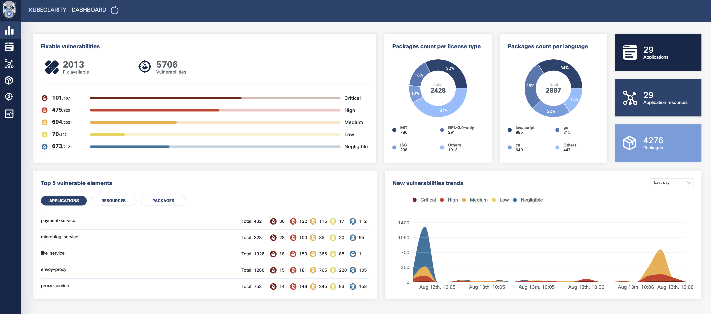
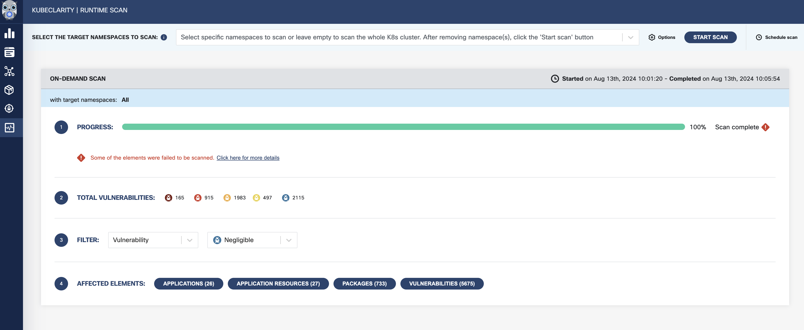
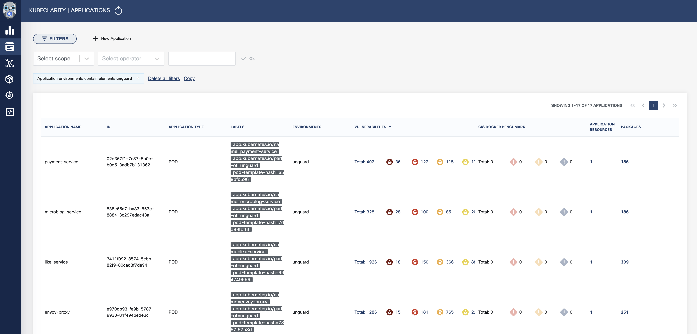
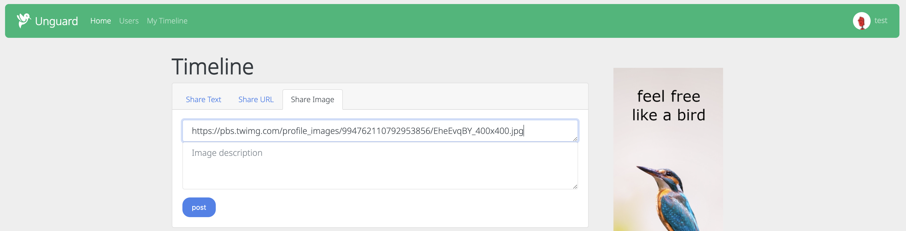

- [演習4-1: Kubernetes のセキュリティベストプラクティス](#演習4-1-kubernetes-のセキュリティベストプラクティス)
  - [監査ログの確認](#監査ログの確認)
  - [Pod Security Standards の適用](#pod-security-standards-の適用)
  - [Security Context の設定](#security-context-の設定)
  - [seccomp の設定](#seccomp-の設定)
  - [distroless イメージの調査](#distroless-イメージの調査)
- [演習4-2: セキュリティツールの利用](#演習4-2-セキュリティツールの利用)
  - [クラスタのセキュリティスキャン (Trivy)](#クラスタのセキュリティスキャン-trivy)
  - [脆弱性管理 (KubeClarity)](#脆弱性管理-kubeclarity)
  - [コンテナプロセスの監視と強制 (Tetragon)](#コンテナプロセスの監視と強制-tetragon)

# 演習4-1: Kubernetes のセキュリティベストプラクティス

Kubernetes のセキュリティベストプラクティスを体験してみましょう。

※ コマンドと出力結果を区別するため、実行コマンドには `$ ` をプレフィックスとして付与します。

[演習環境にアクセス](../ch00_setup/README.md)した後、事前準備として演習用のディレクトリを作成します。

```bash
$ pwd
/root

$ mkdir ch04
$ cd ch04

$ pwd
/root/ch04
```

## 監査ログの確認

演習環境のクラスタでは、コントロールプレーンの `/var/log/kubernetes/kube-apiserver-audit.log` に監査ログを出力しています。
どのようなログが出力されているか確認してみましょう。

以下のコマンドを実行すると出力結果が大量に出るので注意してください。
途中で出力をストップするか、`cat` から `head` コマンドに変えるなどして出力量を制限すると良いです。

```bash
$ docker exec kind-control-plane cat /var/log/kubernetes/kube-apiserver-audit.log
{"kind":"Event","apiVersion":"audit.k8s.io/v1","level":"Metadata","auditID":"4cf311a0-6a75-4364-9d15-5ff65ca99fc4","stage":"RequestReceived","requestURI":"/api/v1/namespaces/default/events","verb":"create","user":{"username":"system:node:kind-control-plane","groups":["system:nodes","system:authenticated"]},"sourceIPs":["172.18.0.2"],"userAgent":"kubelet/v1.30.0 (linux/amd64) kubernetes/7c48c2b","objectRef":{"resource":"events","namespace":"default","apiVersion":"v1"},"requestReceivedTimestamp":"2024-08-11T15:04:42.938588Z","stageTimestamp":"2024-08-11T15:04:42.938588Z"}
{"kind":"Event","apiVersion":"audit.k8s.io/v1","level":"Metadata","auditID":"21d49901-fda4-458f-973c-c582a59f8b6f","stage":"RequestReceived","requestURI":"/apis/storage.k8s.io/v1/csinodes/kind-control-plane?resourceVersion=0","verb":"get","user":{"username":"system:node:kind-control-plane","groups":["system:nodes","system:authenticated"]},"sourceIPs":["172.18.0.2"],"userAgent":"kubelet/v1.30.0 (linux/amd64) kubernetes/7c48c2b","objectRef":{"resource":"csinodes","name":"kind-control-plane","apiGroup":"storage.k8s.io","apiVersion":"v1"},"requestReceivedTimestamp":"2024-08-11T15:04:42.940142Z","stageTimestamp":"2024-08-11T15:04:42.940142Z"}
{"kind":"Event","apiVersion":"audit.k8s.io/v1","level":"Metadata","auditID":"21d49901-fda4-458f-973c-c582a59f8b6f","stage":"ResponseComplete","requestURI":"/apis/storage.k8s.io/v1/csinodes/kind-control-plane?resourceVersion=0","verb":"get","user":{"username":"system:node:kind-control-plane","groups":["system:nodes","system:authenticated"]},"sourceIPs":["172.18.0.2"],"userAgent":"kubelet/v1.30.0 (linux/amd64) kubernetes/7c48c2b","objectRef":{"resource":"csinodes","name":"kind-control-plane","apiGroup":"storage.k8s.io","apiVersion":"v1"},"responseStatus":{"metadata":{},"status":"Failure","message":"csinodes.storage.k8s.io \"kind-control-plane\" not found","reason":"NotFound","details":{"name":"kind-control-plane","group":"storage.k8s.io","kind":"csinodes"},"code":404},"requestReceivedTimestamp":"2024-08-11T15:04:42.940142Z","stageTimestamp":"2024-08-11T15:04:42.940847Z","annotations":{"authorization.k8s.io/decision":"allow","authorization.k8s.io/reason":""}}
...
```

ログの保存先などの設定は、クラスタ構築時の [kind-config.yaml](../ch00_setup/k8s/kind/kind-config.yaml) に記載されています。
また監査ポリシーはシンプルなものです。

```yaml
apiVersion: audit.k8s.io/v1
kind: Policy
rules:
- level: Metadata
```

## Pod Security Standards の適用

Pod Security Admission は、Namespace にラベルを付与することで有効化できます。
まずは dry-run を使い、PSS の `restricted` を強制した場合の影響を調べてみましょう。

```bash
$ kubectl label --dry-run=server --overwrite ns --all pod-security.kubernetes.io/enforce=restricted
namespace/default labeled (server dry run)
Warning: existing pods in namespace "gadget" violate the new PodSecurity enforce level "restricted:latest"
Warning: gadget-cxfq4 (and 2 other pods): forbidden AppArmor profiles, seLinuxOptions, allowPrivilegeEscalation != false, unrestricted capabilities, restricted volume types, runAsNonRoot != true, seccompProfile
namespace/gadget labeled (server dry run)
namespace/ingress-nginx labeled (server dry run)
namespace/kube-node-lease labeled (server dry run)
namespace/kube-public labeled (server dry run)
Warning: existing pods in namespace "kube-system" violate the new PodSecurity enforce level "restricted:latest"
Warning: cilium-gj22n (and 2 other pods): forbidden AppArmor profiles, host namespaces, hostPort, privileged, seLinuxOptions, allowPrivilegeEscalation != false, unrestricted capabilities, restricted volume types, runAsNonRoot != true, seccompProfile
Warning: cilium-operator-9bfb5ffbd-8xch4 (and 1 other pod): host namespaces, hostPort, allowPrivilegeEscalation != false, unrestricted capabilities, runAsNonRoot != true, seccompProfile
Warning: coredns-7db6d8ff4d-rj2vh (and 2 other pods): runAsNonRoot != true, seccompProfile
Warning: etcd-kind-control-plane (and 3 other pods): host namespaces, allowPrivilegeEscalation != false, unrestricted capabilities, restricted volume types, runAsNonRoot != true
Warning: hubble-relay-7c5f6f6774-8g2jz: allowPrivilegeEscalation != false, seccompProfile
Warning: hubble-ui-86f8bf6b94-dtzmg: allowPrivilegeEscalation != false, unrestricted capabilities, runAsNonRoot != true, seccompProfile
Warning: tetragon-gkxbw (and 2 other pods): host namespaces, privileged, allowPrivilegeEscalation != false, unrestricted capabilities, restricted volume types, runAsNonRoot != true, seccompProfile
namespace/kube-system labeled (server dry run)
Warning: existing pods in namespace "kubeclarity" violate the new PodSecurity enforce level "restricted:latest"
Warning: kubeclarity-kubeclarity-8c8c479c6-2pg6v (and 2 other pods): seccompProfile
Warning: kubeclarity-kubeclarity-postgresql-0: allowPrivilegeEscalation != false, unrestricted capabilities, runAsNonRoot != true, seccompProfile
namespace/kubeclarity labeled (server dry run)
Warning: existing pods in namespace "local-path-storage" violate the new PodSecurity enforce level "restricted:latest"
Warning: local-path-provisioner-988d74bc-zxrml: allowPrivilegeEscalation != false, unrestricted capabilities, runAsNonRoot != true, seccompProfile
namespace/local-path-storage labeled (server dry run)
Warning: existing pods in namespace "unguard" violate the new PodSecurity enforce level "restricted:latest"
Warning: unguard-ad-service-66777c45b4-f4728 (and 15 other pods): allowPrivilegeEscalation != false, unrestricted capabilities, runAsNonRoot != true, seccompProfile
Warning: unguard-mariadb-0: unrestricted capabilities, seccompProfile
namespace/unguard labeled (server dry run)
```

PSS に違反している Pod の情報を取得できました。既存のクラスタに後から PSS を適用する場合は、サービス影響が出ないように事前調査をする必要があります。

次は `default` Namespace に PSS を適用してみます。

```bash
$ kubectl label --overwrite ns default pod-security.kubernetes.io/enforce=restricted
```

`restricted` を強制 (`enforce`) すると、ポリシーに違反した Pod の作成に失敗します。

```bash
$ kubectl run pss-example --image nginx
Error from server (Forbidden): pods "pss-example" is forbidden: violates PodSecurity "restricted:latest": allowPrivilegeEscalation != false (container "pss-example" must set securityContext.allowPrivilegeEscalation=false), unrestricted capabilities (container "pss-example" must set securityContext.capabilities.drop=["ALL"]), runAsNonRoot != true (pod or container "pss-example" must set securityContext.runAsNonRoot=true), seccompProfile (pod or container "pss-example" must set securityContext.seccompProfile.type to "RuntimeDefault" or "Localhost")
```

`enforce` から `warn` に変更すると、警告メッセージは出ますが Pod は作成できます。

```bash
$ kubectl label ns default pod-security.kubernetes.io/enforce-
namespace/default unlabeled

$ kubectl label --overwrite ns default pod-security.kubernetes.io/warn=restricted
namespace/default labeled

$ kubectl run pss-example --image nginx
Warning: would violate PodSecurity "restricted:latest": allowPrivilegeEscalation != false (container "pss-example" must set securityContext.allowPrivilegeEscalation=false), unrestricted capabilities (container "pss-example" must set securityContext.capabilities.drop=["ALL"]), runAsNonRoot != true (pod or container "pss-example" must set securityContext.runAsNonRoot=true), seccompProfile (pod or container "pss-example" must set securityContext.seccompProfile.type to "RuntimeDefault" or "Localhost")
pod/pss-example created

$ kubectl get po
NAME          READY   STATUS    RESTARTS   AGE
pss-example   1/1     Running   0          10s
```

今度は `warn` から `audit` に変更し、Pod を再作成してみます。

```bash
$ kubectl delete po pss-example
pod "pss-example" deleted

$ kubectl label ns default pod-security.kubernetes.io/warn-
namespace/default unlabeled

$ kubectl label --overwrite ns default pod-security.kubernetes.io/audit=restricted
namespace/default labeled

$ kubectl run pss-example --image nginx
pod/pss-example created
```

問題なく Pod を作成できているように見えますが、監査ログには違反メッセージが記録されます。

```bash
$ docker exec -it kind-control-plane tail -n 10000 /var/log/kubernetes/kube-apiserver-audit.log | grep 'pod-security.kubernetes.io/audit-violations' | grep pss-example
{"kind":"Event","apiVersion":"audit.k8s.io/v1","level":"Metadata","auditID":"0cf28c0d-7508-4ff0-b65a-d59f5fbfb710","stage":"ResponseComplete","requestURI":"/api/v1/namespaces/default/pods?fieldManager=kubectl-run","verb":"create","user":{"username":"kubernetes-admin","groups":["kubeadm:cluster-admins","system:authenticated"]},"sourceIPs":["172.18.0.1"],"userAgent":"kubectl/v1.30.3 (linux/amd64) kubernetes/6fc0a69","objectRef":{"resource":"pods","namespace":"default","name":"pss-example","apiVersion":"v1"},"responseStatus":{"metadata":{},"code":201},"requestReceivedTimestamp":"2024-08-14T05:40:56.794659Z","stageTimestamp":"2024-08-14T05:40:56.801855Z","annotations":{"authorization.k8s.io/decision":"allow","authorization.k8s.io/reason":"RBAC: allowed by ClusterRoleBinding \"kubeadm:cluster-admins\" of ClusterRole \"cluster-admin\" to Group \"kubeadm:cluster-admins\"","pod-security.kubernetes.io/audit-violations":"would violate PodSecurity \"restricted:latest\": allowPrivilegeEscalation != false (container \"pss-example\" must set securityContext.allowPrivilegeEscalation=false), unrestricted capabilities (container \"pss-example\" must set securityContext.capabilities.drop=[\"ALL\"]), runAsNonRoot != true (pod or container \"pss-example\" must set securityContext.runAsNonRoot=true), seccompProfile (pod or container \"pss-example\" must set securityContext.seccompProfile.type to \"RuntimeDefault\" or \"Localhost\")","pod-security.kubernetes.io/enforce-policy":"privileged:latest"}}
```

一通り確認できたら、環境をクリーンアップします。

```bash
$ kubectl delete po pss-example
$ kubectl label ns default pod-security.kubernetes.io/audit-
```

参考: https://kubernetes.io/docs/tutorials/security/cluster-level-pss/

## Security Context の設定

Security Context を設定した Deployment を作成し、コンテナの様子を確認してみましょう。

```bash
$ cat <<EOF > nginx-securit-context.yaml
apiVersion: apps/v1
kind: Deployment
metadata:
  name: nginx-security-context
spec:
  strategy:
    type: Recreate
  replicas: 1
  selector:
    matchLabels:
      app: nginx-security-context
  template:
    metadata:
      labels:
        app: nginx-security-context
    spec:
      securityContext:
        runAsNonRoot: true
        runAsUser: 1000
        runAsGroup: 1000
      containers:
      - name: nginx
        image: nginx
        securityContext:
          readOnlyRootFilesystem: true
          allowPrivilegeEscalation: false
          capabilities:
            drop: ["ALL"]
EOF

$ kubectl apply -f nginx-securit-context.yaml
deployment.apps/nginx-security-context created

$ kubectl get po
NAME                                      READY   STATUS             RESTARTS      AGE
nginx-security-context-58c586f9f9-v8rgc   0/1     CrashLoopBackOff   2 (22s ago)   43s
```

Deployment は作成されましたが、コンテナの実行に失敗しています。Security Context を設定したことでアプリケーションの実行に問題が出ているようです。

この問題を解消し、nginx が正常に実行できるようにしてください。

ノーヒントで始めても良いですし、以下の「実行ステップ」を見ながら進めても良いです。回答は「修正済みマニフェスト」に用意しています。

<details><summary>実施プロセス</summary>

1. `kubectl describe` や `kubectl logs` でコンテナ実行のエラーの原因を調査する
2. ディレクトリの作成に失敗する場合
   1. コンテナ内で書き込みが必要なパスを emptyDir でマウントする
   - https://kubernetes.io/docs/concepts/storage/volumes/#emptydir
3. 80番ポートの使用に失敗する場合
   - 使用するコンテナイメージを、80番ポートを使用しないものに変更する
   - https://hub.docker.com/r/nginxinc/nginx-unprivileged
4. イメージ変更による追加の設定変更が必要であれば実施する
5. 修正が完了したら `kubectl apply` を実行し、コンテナが正常に実行されるか確認する

</details>

<details><summary>修正済みマニフェスト</summary>

```yaml
apiVersion: apps/v1
kind: Deployment
metadata:
  name: nginx-security-context
spec:
  strategy:
    type: Recreate
  replicas: 1
  selector:
    matchLabels:
      app: nginx-security-context
  template:
    metadata:
      labels:
        app: nginx-security-context
    spec:
      securityContext:
        runAsNonRoot: true
        runAsUser: 1000
        runAsGroup: 1000
      containers:
      - name: nginx
        image: nginxinc/nginx-unprivileged
        securityContext:
          readOnlyRootFilesystem: true
          allowPrivilegeEscalation: false
          capabilities:
            drop: ["ALL"]
        volumeMounts:
        - mountPath: /tmp
          name: tmp
      volumes:
      - name: tmp
        emptyDir: {}
```

</details>

<br/>

nginx コンテナを実行できたら、コンテナに `exec` して動作確認してみます。ここでは検証できていない Security Context の設定もありますが、各設定の役割はぜひ調べてみてください。

```bash
$ kubectl get po
NAME                                      READY   STATUS    RESTARTS   AGE
nginx-security-context-7949d4b5b7-kr8wf   1/1     Running   0          3s

$ kubectl exec -it nginx-security-context-7949d4b5b7-kr8wf -- bash

# ここからコンテナ内の動作

# 実行ユーザーの確認
$ id
uid=1000 gid=1000 groups=1000

# ファイル作成不可
$ touch /test
touch: cannot touch '/test': Read-only file system

# 8080番ポートの使用
$ curl 127.0.0.1:8080
<!DOCTYPE html>
<html>
<head>
<title>Welcome to nginx!</title>
<style>
html { color-scheme: light dark; }
body { width: 35em; margin: 0 auto;
font-family: Tahoma, Verdana, Arial, sans-serif; }
</style>
</head>
<body>
<h1>Welcome to nginx!</h1>
<p>If you see this page, the nginx web server is successfully installed and
working. Further configuration is required.</p>

<p>For online documentation and support please refer to
<a href="http://nginx.org/">nginx.org</a>.<br/>
Commercial support is available at
<a href="http://nginx.com/">nginx.com</a>.</p>

<p><em>Thank you for using nginx.</em></p>
</body>
</html>
```

一通り確認できたら、環境をクリーンアップします。

```bash
$ kubectl delete -f nginx-securit-context.yaml
```

## seccomp の設定

seccomp を設定した Pod を作成し、コンテナの動作を確認してみましょう。

```bash
$ cat <<EOF > nginx-seccomp.yaml
apiVersion: v1
kind: Pod
metadata:
  name: nginx-seccomp
spec:
  containers:
  - name: nginx
    image: nginx
    securityContext:
      seccompProfile:
        type: RuntimeDefault
EOF

$ kubectl apply -f nginx-seccomp.yaml
pod/nginx-seccomp created

$ unshare -rmC bash
unshare: unshare failed: Operation not permitted
```

`unshare` コマンドの実行が禁止されました。`unshare` はコンテナブレイクアウトにも使われますが、seccomp が有効であれば脆弱性があったとしても悪用できなくなります。

seccompProfile には `RuntimeDefault` を指定しています。これはコンテナランタイムが提供するデフォルトの seccomp プロファイルです。
演習環境のクラスタは containerd を使用しているので、デフォルト seccomp は containerd のソースコードから見つけることができます。

https://github.com/containerd/containerd/blob/main/contrib/seccomp/seccomp_default.go#L55

seccomp プロファイルを自作する場合、必要なシステムコールを自力で洗い出すのは手間がかかります。
ここでは [Inspektor Gadget](https://github.com/inspektor-gadget/inspektor-gadget) を使用して実行プロセスからプロファイルを生成する方法を試してみます。

https://www.inspektor-gadget.io/docs/latest/gadgets/builtin/advise/seccomp-profile

`kubectl gadget advise seccomp-profile start` でトレースを開始します。対象には好きな Pod を指定してください。

```bash
$ kubectl gadget advise seccomp-profile start -n unguard -p unguard-envoy-proxy-7857f57b8d-qpv8s
u97xe2MKe1Kx7nTw
```

対象 Pod に Web UI を通してリクエストを流したり（ポートフォワードが必要）、`kubectl exec` を実行したりした後、トレースを終了すると seccomp プロファイルが生成されます。

```bash
$ kubectl gadget advise seccomp-profile stop u97xe2MKe1Kx7nTw
{
  "defaultAction": "SCMP_ACT_ERRNO",
  "architectures": [
    "SCMP_ARCH_X86_64",
    "SCMP_ARCH_X86",
    "SCMP_ARCH_X32"
  ],
  "syscalls": [
    {
      "names": [
        "accept4",
        "bind",
        "clock_gettime",
        "close",
        "connect",
        "epoll_ctl",
        "epoll_wait",
        "fcntl",
        "fstat",
        "futex",
        "getsockname",
        "getsockopt",
        "gettimeofday",
        "mincore",
        "mprotect",
        "openat",
        "read",
        "readv",
        "recvfrom",
        "recvmsg",
        "sendto",
        "setsockopt",
        "socket",
        "write",
        "writev"
      ],
      "action": "SCMP_ACT_ALLOW"
    }
  ]
}
```

作成したプロファイルを Pod から利用するには、ノードの `/var/lib/kubelet/seccomp/` に配置する必要があります。Pod マニフェスト内では `localhostProfile` でパスを指定します。

```yaml
  securityContext:
    seccompProfile:
      type: Localhost
      localhostProfile: profiles/unguard-envoy-proxy.json
```

また [Security Profiles Operator](https://github.com/kubernetes-sigs/security-profiles-operator) と連携することで、ノードへのプロファイル配置を自動化することもできます。

一通り確認できたら、環境をクリーンアップします。

```bash
$ kubectl delete -f nginx-seccomp.yaml
```

## distroless イメージの調査

Chainguard Images から nginx のコンテナイメージを取得し、trivy を使って不要なパッケージを含まないか調べてみます。

```bash
$ trivy image cgr.dev/chainguard/nginx
2024-08-14T17:27:31Z    INFO    [db] Need to update DB
2024-08-14T17:27:31Z    INFO    [db] Downloading DB...  repository="ghcr.io/aquasecurity/trivy-db:2"
51.41 MiB / 51.41 MiB [--------------------------------------------------------------------------------------------------------------------------------------------------] 100.00% 23.14 MiB p/s 2.4s
2024-08-14T17:27:34Z    INFO    [vuln] Vulnerability scanning is enabled
2024-08-14T17:27:34Z    INFO    [secret] Secret scanning is enabled
2024-08-14T17:27:34Z    INFO    [secret] If your scanning is slow, please try '--scanners vuln' to disable secret scanning
2024-08-14T17:27:34Z    INFO    [secret] Please see also https://aquasecurity.github.io/trivy/v0.54/docs/scanner/secret#recommendation for faster secret detection
2024-08-14T17:27:37Z    WARN    [sbom] Ignore the OS package as no OS is detected.      file_path="var/lib/db/sbom/glibc-2.39-r8.spdx.json"
2024-08-14T17:27:37Z    WARN    [sbom] Ignore the OS package as no OS is detected.      file_path="var/lib/db/sbom/glibc-locale-posix-2.39-r8.spdx.json"
2024-08-14T17:27:37Z    WARN    [sbom] Ignore the OS package as no OS is detected.      file_path="var/lib/db/sbom/ld-linux-2.39-r8.spdx.json"
2024-08-14T17:27:37Z    WARN    [sbom] Ignore the OS package as no OS is detected.      file_path="var/lib/db/sbom/libcrypt1-2.39-r8.spdx.json"
2024-08-14T17:27:37Z    WARN    [sbom] Ignore the OS package as no OS is detected.      file_path="var/lib/db/sbom/libcrypto3-3.3.1-r5.spdx.json"
2024-08-14T17:27:37Z    WARN    [sbom] Ignore the OS package as no OS is detected.      file_path="var/lib/db/sbom/libgcc-13.3.0-r2.spdx.json"
2024-08-14T17:27:37Z    WARN    [sbom] Ignore the OS package as no OS is detected.      file_path="var/lib/db/sbom/libssl3-3.3.1-r5.spdx.json"
2024-08-14T17:27:37Z    WARN    [sbom] Ignore the OS package as no OS is detected.      file_path="var/lib/db/sbom/ca-certificates-bundle-20240705-r0.spdx.json"
2024-08-14T17:27:37Z    WARN    [sbom] Ignore the OS package as no OS is detected.      file_path="var/lib/db/sbom/libstdc++-13.3.0-r2.spdx.json"
2024-08-14T17:27:37Z    WARN    [sbom] Ignore the OS package as no OS is detected.      file_path="var/lib/db/sbom/libxcrypt-4.4.36-r7.spdx.json"
2024-08-14T17:27:37Z    WARN    [sbom] Ignore the OS package as no OS is detected.      file_path="var/lib/db/sbom/nginx-mainline-1.27.0-r7.spdx.json"
2024-08-14T17:27:37Z    WARN    [sbom] Ignore the OS package as no OS is detected.      file_path="var/lib/db/sbom/nginx-mainline-package-config-1.27.0-r7.spdx.json"
2024-08-14T17:27:37Z    WARN    [sbom] Ignore the OS package as no OS is detected.      file_path="var/lib/db/sbom/nginx-mainline-config-1.27.0-r7.spdx.json"
2024-08-14T17:27:37Z    WARN    [sbom] Ignore the OS package as no OS is detected.      file_path="var/lib/db/sbom/wolfi-baselayout-20230201-r15.spdx.json"
2024-08-14T17:27:37Z    WARN    [sbom] Ignore the OS package as no OS is detected.      file_path="var/lib/db/sbom/pcre-8.45-r3.spdx.json"
2024-08-14T17:27:37Z    WARN    [sbom] Ignore the OS package as no OS is detected.      file_path="var/lib/db/sbom/zlib-1.3.1-r4.spdx.json"
2024-08-14T17:27:37Z    INFO    Detected OS     family="wolfi" version="20230201"
2024-08-14T17:27:37Z    INFO    [wolfi] Detecting vulnerabilities...    pkg_num=16
2024-08-14T17:27:37Z    INFO    Number of language-specific files       num=0

cgr.dev/chainguard/nginx (wolfi 20230201)

Total: 0 (UNKNOWN: 0, LOW: 0, MEDIUM: 0, HIGH: 0, CRITICAL: 0)
```

検出された脆弱性は0件でした。
また `Ignore the OS package as no OS is detected.` と出力されることから distroless イメージであることがわかります。

SBOM を作成してコンテナに含まれるパッケージを調べてみると、以下のように最小限のパッケージのみ含まれていました。

```bash
$ trivy image --format spdx-json --output trivy-result.json cgr.dev/chainguard/nginx

$ cat trivy-result.json | jq '.packages[].name'
"cgr.dev/chainguard/nginx"
"ca-certificates-bundle"
"glibc"
"glibc-locale-posix"
"ld-linux"
"libcrypt1"
"libcrypto3"
"libgcc"
"libssl3"
"libstdc++"
"libxcrypt"
"nginx-mainline"
"nginx-mainline-config"
"nginx-mainline-package-config"
"pcre"
"wolfi-baselayout"
"zlib"
"wolfi"
```

もちろんこのイメージから nginx を正常に実行することができます。

```bash
$ docker run --rm --expose 8080 --name nginx-distroless -d cgr.dev/chainguard/nginx
55947c73e38e202c60f2e2a1bbc654ecb386b73e7f73b05ad74f50bb7e7aabbb

$ curl $(docker inspect -f '{{range.NetworkSettings.Networks}}{{.IPAddress}}{{end}}' nginx-distroless):8080
<!DOCTYPE html>
<html>
<head>
<title>Welcome to nginx!</title>
<style>
html { color-scheme: light dark; }
body { width: 35em; margin: 0 auto;
font-family: Tahoma, Verdana, Arial, sans-serif; }
</style>
</head>
<body>
<h1>Welcome to nginx!</h1>
<p>If you see this page, the nginx web server is successfully installed and
working. Further configuration is required.</p>

<p>For online documentation and support please refer to
<a href="http://nginx.org/">nginx.org</a>.<br/>
Commercial support is available at
<a href="http://nginx.com/">nginx.com</a>.</p>

<p><em>Thank you for using nginx.</em></p>
</body>
</html>

$ docker stop nginx-distroless
```

# 演習4-2: セキュリティツールの利用

ツールを利用したセキュリティ運用を体験してみましょう。

## クラスタのセキュリティスキャン (Trivy)

trivy はさまざまなスキャンに対応しており、今回は Kubernetes クラスタのセキュリティ状況をチェックします。
以下のコマンドでスキャンできますが、実行にかなり時間がかかる点に注意してください。

```bash
# 設定ミスの検出
trivy k8s --scanners misconfig --misconfig-scanners dockerfile,helm,kubernetes --report all --timeout 30m --debug --tolerations node-role.kubernetes.io/control-plane=:NoSchedule -o trivy-result-misconfig.txt

# コンプライアンスレポートの作成
trivy k8s --compliance=k8s-pss-baseline-0.1 --report all --timeout 30m --debug --tolerations node-role.kubernetes.io/control-plane=:NoSchedule -o trivy-result-pss.txt

trivy k8s --compliance=k8s-nsa-1.0 --report all --timeout 30m --debug --tolerations node-role.kubernetes.io/control-plane=:NoSchedule -o trivy-result-nsa.txt

trivy k8s --compliance=k8s-cis-1.23 --report all --timeout 30m --debug --tolerations node-role.kubernetes.io/control-plane=:NoSchedule -o trivy-result-cis.txt
```

事前に実施したそれぞれのスキャン結果を[こちら](./trivy/)に配置しています。

trivy のスキャン結果を調べ、次の観点で検出項目を評価してください。
（大量に検知されていると思うので可能な範囲で大丈夫です）

- どのような項目が検出されているか
- 検出された設定ミスを放置するとどのようなリスクがあるか
- 優先的に対応すべき項目はどれか

## 脆弱性管理 (KubeClarity)

KubeClarity は Ingress でクラスタ外に公開されています。

```bash
$ kubectl get ingress -n kubeclarity
NAME                      CLASS   HOSTS                     ADDRESS         PORTS   AGE
kubeclarity-kubeclarity   nginx   kubeclarity.seccamp.com   10.96.200.169   80      3d20h
```

[セットアップ手順](../ch00_setup/README.md)の通りにローカル環境からポートフォワードを実行すると、ブラウザから `kubeclarity.seccamp.com:8081` で KubeClarity の Web UI にアクセスできます。

トップページにはクラスタ内の脆弱性情報のサマリーが表示されます。



もしスキャン実行前であれば、左のメニューから「Runtime Scan」画面に遷移し、画面右上の「Start Scan」を実行してください。スキャン完了までに数分かかります。



スキャンが完了したらアプリケーションの脆弱性情報を自由に確認してみましょう。



余裕があれば、Kubeclarity をどのように運用するのか考えてみることをお勧めします。

- 脆弱性管理をどのようなフローで実施するか
- Kubeclarity で運用に必要な機能が揃っているか、または足りないものがあるか
- 運用コストはどの程度かかりそうか

## コンテナプロセスの監視と強制 (Tetragon)

Tetragon は演習環境のクラスタにデプロイ済みです。

```bash
$ kubectl get all -n kube-system | grep tetragon
pod/tetragon-7pgpm                               2/2     Running   1 (3d20h ago)   3d20h
pod/tetragon-fxdcz                               2/2     Running   1 (3d20h ago)   3d20h
pod/tetragon-ltjjn                               2/2     Running   1 (3d20h ago)   3d20h
pod/tetragon-operator-84bb9bc55c-hrscz           1/1     Running   0               3d20h
service/tetragon                    ClusterIP   10.96.141.87    <none>        2112/TCP                 3d20h
service/tetragon-operator-metrics   ClusterIP   10.96.86.14     <none>        2113/TCP                 3d20h
daemonset.apps/tetragon   3         3         3       3            3           <none>                   3d20h
deployment.apps/tetragon-operator   1/1     1            1           3d20h
replicaset.apps/tetragon-operator-84bb9bc55c   1         1         1       3d20h
```

`unguard` Namespace にプロセス実行制限のポリシーを適用し、動作検証してみましょう。

（コピペしやすいように `$` は除いています）

```bash
cat <<EOF > file-access-restrictions.yaml
apiVersion: cilium.io/v1alpha1
kind: TracingPolicyNamespaced
metadata:
  name: "file-access-restrictions"
  namespace: unguard
spec:
  podSelector:
    matchLabels:
      app.kubernetes.io/name: proxy-service
      app.kubernetes.io/part-of: unguard
  kprobes:
  - call: "security_file_permission"
    message: "File access denied"
    syscall: false
    return: true
    args:
    - index: 0
      type: "file" # (struct file *) used for getting the path
    - index: 1
      type: "int" # 0x04 is MAY_READ, 0x02 is MAY_WRITE
    returnArg:
      index: 0
      type: "int"
    returnArgAction: "Post"
    selectors:
    - matchArgs:      
      - index: 0
        operator: "Prefix"
        values:
        - "/boot"           # Reads to sensitive directories
        - "/root/.ssh"      # Reads to sensitive files we want to know about
        - "/etc/shadow"
        - "/etc/profile"
        - "/etc/sudoers"
        - "/etc/pam.conf"   # Reads global shell configs bash/csh supported
        - "/etc/bashrc"
        - "/etc/csh.cshrc"
        - "/etc/csh.login"  # Add additional sensitive files here
      - index: 1
        operator: "Equal"
        values:
        - "4" # MAY_READ
      matchActions:
      - action: Sigkill
    - matchArgs:      
      - index: 0
        operator: "Postfix"
        values:
        - ".bashrc"         # Reads to shell config files bash, csh supported
        - ".bash_profile"   # add any other shell support here.
        - ".bash_login"
        - ".bash_logout"
        - ".cshrc"
        - ".cshdirs"
        - ".profile"        # Reads to common environments files
        - ".login"
        - ".logout"
        - ".history"        # Add additional sensitive files here
      - index: 1
        operator: "Equal"
        values:
        - "4" # MAY_READ
      matchActions:
      - action: Sigkill
    - matchArgs:      
      - index: 0
        operator: "Prefix"
        values:
        - "/etc"              # Writes to sensitive directories
        - "/boot"
        - "/lib"
        - "/lib64"
        - "/bin"
        - "/usr/lib"
        - "/usr/local/lib"
        - "/usr/local/sbin"
        - "/usr/local/bin"
        - "/usr/bin"
        - "/usr/sbin"
        - "/var/log"          # Writes to logs
        - "/dev/log"
        - "/root/.ssh"        # Writes to sensitive files add here.
      - index: 1
        operator: "Equal"
        values:
        - "2" # MAY_WRITE
      matchActions:
      - action: Sigkill
  - call: "security_mmap_file"
    syscall: false
    return: true
    args:
    - index: 0
      type: "file"
    - index: 1
      type: "uint32"
    - index: 2
      type: "nop"
    returnArg:
      index: 0
      type: "int"
    returnArgAction: "Post"
    selectors:
    - matchPIDs:
      - operator: NotIn
        followForks: true
        isNamespacePID: true
        values:
        - 0
        - 1
    - matchBinaries:
      - operator: "In"
        values:
        - "/bin/bash"
        - "/bin/chmod"
        - "/bin/chown"
        - "/usr/bin/bash"
        - "/usr/bin/passwd"
      matchActions:
      - action: Sigkill
EOF

cat <<EOF > only-clusterip-access.yaml
apiVersion: cilium.io/v1alpha1
kind: TracingPolicyNamespaced
metadata:
  name: "only-clusterip-access"
  namespace: unguard
spec:
  podSelector:
    matchLabels:
      app.kubernetes.io/name: proxy-service
      app.kubernetes.io/part-of: unguard
  kprobes:
  - call: "tcp_connect"
    message: "Only allow connections to ClusterIP services"
    syscall: false
    args:
    - index: 0
      type: "sock"
    selectors:
    - matchArgs:
      - index: 0
        operator: "NotDAddr"
        values:
        - 127.0.0.1
        - "10.0.0.0/8" # podCIDR
        - "10.96.0.0/12" # serviceCIDR
      matchActions:
      - action: Sigkill
EOF

kubectl apply -f file-access-restrictions.yaml
kubectl apply -f only-clusterip-access.yaml
```

tetragon CLI を使い、3章で攻撃に利用した `unguard-proxy-service` のプロセスをトレースします。
以下コマンドを実行すると、Pod の[セキュリティイベント](https://tetragon.io/docs/overview/)をリアルタイムに出力してくれるようになります。

```bash
$ POD=$(kubectl get po -n unguard -l app.kubernetes.io/name=proxy-service,app.kubernetes.io/part-of=unguard -o jsonpath='{.items[*].metadata.name}')
$ NAMESPACE=unguard
$ kubectl exec -ti -n kube-system $(kubectl -n kube-system get pods -l 'app.kubernetes.io/name=tetragon' -o name --field-selector spec.nodeName=$(kubectl get pod -n $NAMESPACE $POD -o jsonpath='{.spec.nodeName}')) -c tetragon -- tetra getevents -o compact --pods $POD
```

この状態でSNSサービスの画像投稿をポストしてみると、画像の投稿に失敗します。




tetragon の出力を見ると `curl` の実行に失敗していることがわかります。これは tetragon のポリシーでクラスタ外部へのリクエストを禁止しているためです。

```bash
🚀 process unguard/unguard-proxy-service-5b84d8dd85-rcqdt /usr/bin/curl --silent -S https://pbs.twimg.com/profile_images/994762110792953856/EheEvqBY_400x400.jpg --max-time 10 --output /tmp/img-1723547297705.jpg
🔌 connect unguard/unguard-proxy-service-5b84d8dd85-rcqdt /usr/bin/curl tcp 10.0.0.96:44176 -> 151.101.108.159:443
💥 exit    unguard/unguard-proxy-service-5b84d8dd85-rcqdt /usr/bin/curl --silent -S https://pbs.twimg.com/profile_images/994762110792953856/EheEvqBY_400x400.jpg --max-time 10 --output /tmp/img-1723547297705.jpg SIGKILL
💥 exit    unguard/unguard-proxy-service-5b84d8dd85-rcqdt /bin/sh -c "curl --silent -S https://pbs.twimg.com/profile_images/994762110792953856/EheEvqBY_400x400.jpg --max-time 10 --output /tmp/img-1723547297705.jpg" 137
```

今度は別のターミナルを開き、そこから該当 Pod に `kubectl exec` を試みます。

```bash
$ POD=$(kubectl get po -n unguard -l app.kubernetes.io/name=proxy-service,app.kubernetes.io/part-of=unguard -o jsonpath='{.items[*].metadata.name}')
$ kubectl exec -it -n unguard $POD -- bash
command terminated with exit code 137
```

プロセスが終了してしまいました。
この時の tetragon の出力結果から、`bash` の実行に失敗していることがわかります。

```bash
🚀 process unguard/unguard-proxy-service-5b84d8dd85-rcqdt /bin/bash
📚 read    unguard/unguard-proxy-service-5b84d8dd85-rcqdt /bin/bash /etc/bash.bashrc
📚 read    unguard/unguard-proxy-service-5b84d8dd85-rcqdt /bin/bash /etc/bash.bashrc
💥 exit    unguard/unguard-proxy-service-5b84d8dd85-rcqdt /bin/bash  SIGKILL
```

これはファイルアクセスの制限によるものですが、ポリシーの中のどのルールがこれに該当するかわかりますか？
もし余裕があれば、該当項目をポリシーから削除し、`bash` が実行できるようになるか試してみてください。

`bash` の実行ができなくなったことで Pod への不正アクセスを防げると思うかもしれませんが、これにはさまざまなバイパス手段が存在します。

```bash
$ kubectl exec -it -n unguard $POD -- sh
```

今回適用したようなシンプルなポリシーには多数の抜け道が存在します。上記以外にどのようなバイパス手段があるのか、色々と試してみると面白いと思います。

あらゆるパターンを網羅した完璧なセキュリティポリシーを作ることは非常に難しく、結局は他のセキュリティ対策と組み合わせ、多層的に対策するしかありません。
